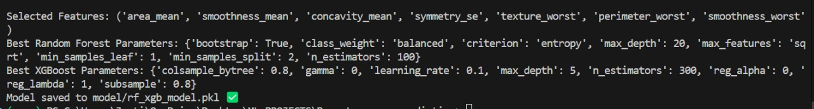
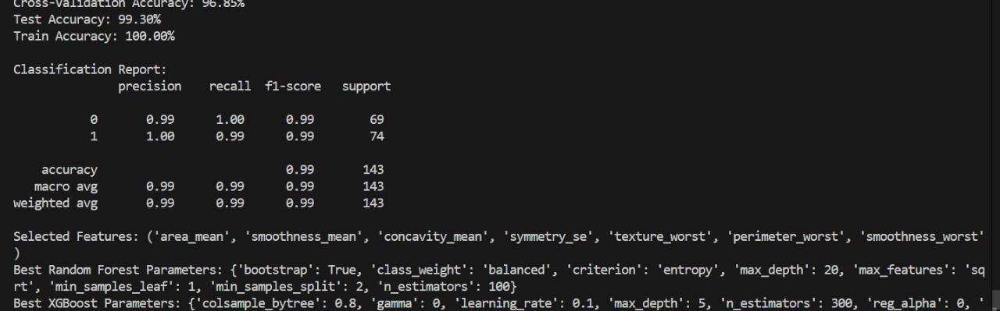

# 🧠 Breast Cancer Prediction with Ensemble ML Models

A machine learning-powered web app to predict **Malignant** or **Benign** breast cancer based on medical features. The model uses an **ensemble of Random Forest and XGBoost**, trained on the **Wisconsin Breast Cancer Dataset**.

> ⚡ Live App: [https://breastcancerprediction-ml.streamlit.app](https://breastcancerprediction-ml.streamlit.app)


📊 Project Highlights

📁 Dataset: Breast Cancer Wisconsin (Diagnostic) Data Set
📈 Accuracy: 99.30% on test data
🤖 Models Used: Random Forest, XGBoost
🧟‍♂️ Ensemble Technique: Soft Voting Classifier
📦 Preprocessing: Label Encoding, SMOTE (Balancing), Scaling, Log Transform
🔍 Feature Selection: Sequential Forward Selection (7 key features)

---

 🚀 Demo Screenshots

 🔹 Selected Features 



🔹 Classification Report



🔹 Confusion Matrix


---

 ⚙️ Tech Stack

| Tool/Library       | Purpose                              |
| ------------------ | ------------------------------------ |
| Python (v3.12.8)     | Programming Language                 |
| Streamlit          | Web App Framework                    |
| scikit-learn       | ML Models, Preprocessing, Evaluation |
| XGBoost            | Gradient Boosting Model              |
| SMOTE (imblearn)   | Handling Data Imbalance              |
| joblib             | Model Serialization                  |
| Matplotlib/Seaborn | Visualizations                       |

---

🧪 Model Performance

| Metric                    | Value   |
| ------------------------- | ------- |
| **Train Accuracy**        | 100.00% |
| **Test Accuracy**        | 99.30%  |
| **Precision (Malignant)** | 1.00    |
| **Recall (Malignant)**    | 0.99    |
| **F1-Score (Malignant)**  | 0.99    |

💪 **Robust performance with minimal overfitting.**

---

 🛠️ How to Run Locally

1. **Clone the Repo**

   ```bash
   git clone https://github.com/Jiyaaaa21/Breast_Cancer_Prediction.git
   cd Breast_Cancer_Prediction
   ```

2. **Create & Activate Virtual Environment**

   ```bash
   python -m venv venv
   venv\Scripts\activate  # Windows
   ```

3. **Install Requirements**

   ```bash
   pip install -r requirements.txt
   ```

4. **Run the App**

   ```bash
   streamlit run app.py
   ```

---

## 📂 Project Structure

```
🔹 app.py                   # Streamlit frontend
🔹 train_model.py           # Model training pipeline
🔹 predict_model.py         # Terminal-based input script
🔹 model/                   # Saved model files (.pkl)
🔹 data/                    # Dataset (CSV)
🔹 images/                  # Visualizations
🔹 requirements.txt         # Python dependencies
🔹 README.md                # You're here 😄
```

---

🙋‍♀️ Author

Made with 💡 and 💪 by **[Jyoti](https://github.com/Jiyaaaa21)**

> “Discipline today = Pride tomorrow.”

---

## 📌 Future Scope

* Upload CSV & get batch predictions
* Add confidence intervals and feature impact explanation (SHAP)
* Deploy to HuggingFace/Gradio for broader access

---

## ⭐ If you like this project...

Give it a ⭐ on GitHub and share with your friends in tech/hackathon circles!
